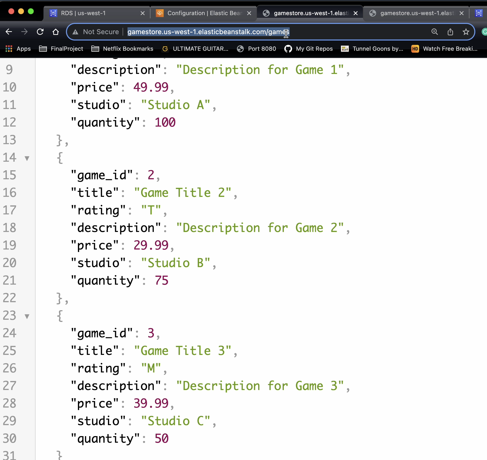
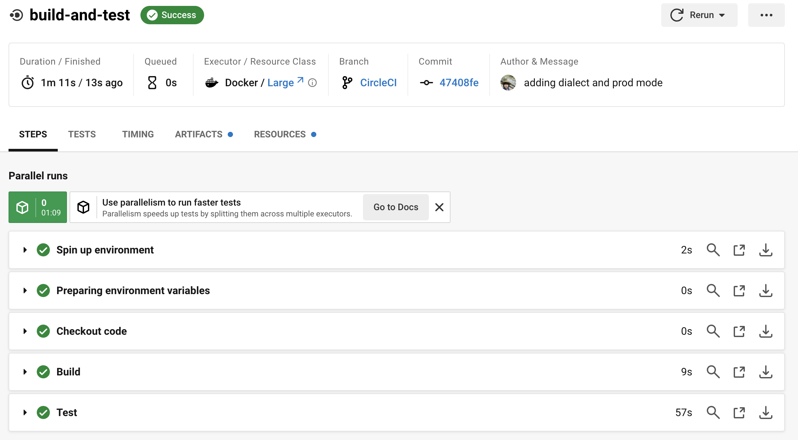

# Game Store API
## Description
This projects implements a game store inventory using Java JPA, Spring boot,
MySQL, and Maven. 

generate table of contents
* [Game Store API](#game-store-api)
  * [Description](#description)
  * [Technologies](#technologies)
  * [Features](#features)
    * [Game](#game)
    * [Console](#console)
    * [T-Shirt](#t-shirt)
    * [Invoice](#invoice)
  * [GraphQL](#graphql)
  * [Deployment](#deployment)
  * [How to run](#how-to-run)
  * [Members](#members)
## Features
### Game
- User can create, read, update, and delete games
- User can find game by title
- User can find game by ESRB rating
- User can find game by studio

### Console
- User can create, read, update, and delete consoles.
- User can find console by manufacturer

### T-Shirt
- User can create, read, update, and delete t-shirts.
- User can find t-shirt by color

### Invoice
- User can create, read, and delete invoices.
- User can find Invoice By Customer Name
- Invoice has a post endpoint that accepts a view model object and generates an invoice.

### GraphQL:
- User can query to get all Games, as well as by ID, Title, ESRB Rating, and Studio.
- User can query to get all Consoles, as well as by ID and Manufacturer.

### Deployment
    Deployed to AWS RDS and Elastic Beanstalk
  

    Ensured smooth releases by using a CI/CD pipeline with CircleCI

 *Note*: To view CI/CD pipeline, please visit the CircleCI branch

### How to run

### Members
Frankie Ortiz, Max Pugh, Abena Aboagyewaa Ofosu, Okeke Duke
 
 